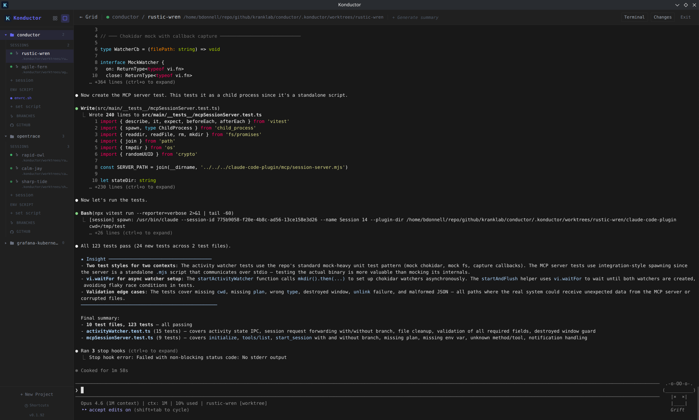
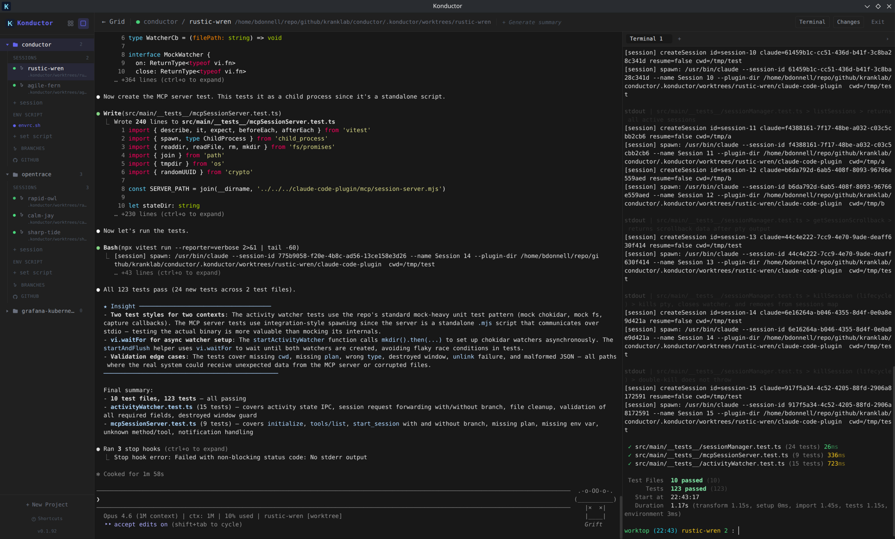
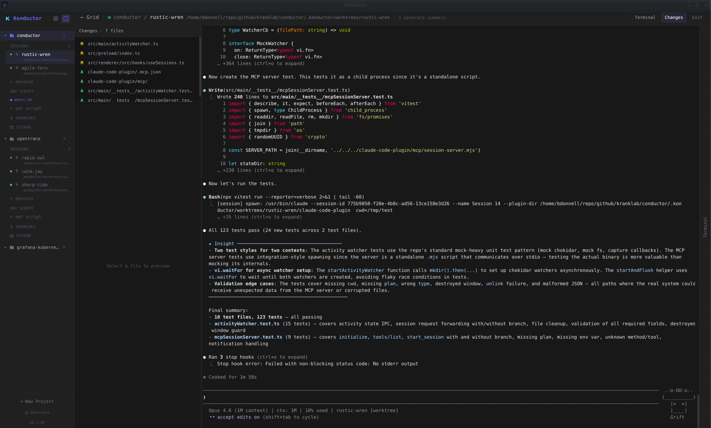

# Konductor

Claude Code Session Manager — manage multiple Claude Code terminal sessions from a single UI.



<details>
<summary>More screenshots</summary>





</details>

## Getting Started

### Prerequisites

- [Claude Code CLI](https://docs.anthropic.com/en/docs/claude-code) installed and available in your shell PATH
- [GitHub CLI (`gh`)](https://cli.github.com/) installed and authenticated — used for listing pull requests and issues

### Quick Start

1. **Install the AppImage** (Linux — easiest):

   ```bash
   curl -fSL https://raw.githubusercontent.com/kranklab/konductor/main/install.sh | bash
   ```

2. **Launch Konductor** — it will appear in your applications menu, or run `konductor` from the terminal.

3. **Create a project** — click the **+** button in the sidebar and point it at a repository.

4. **Start a session** — click **New Session** to spawn a Claude Code terminal. You can run multiple sessions side-by-side in grid view, or switch to focus view for a single session.

5. **Manage worktrees** — use the branches view to create git worktrees so each session can work on an independent branch without conflicts.

## Install

One-line install — downloads the AppImage, installs it to `~/.local/bin`, and adds a desktop entry:

```bash
curl -fSL https://raw.githubusercontent.com/kranklab/konductor/main/install.sh | bash
```

Or manually download from the [`latest` release](../../releases/tag/latest):

```bash
curl -fSL "https://github.com/kranklab/konductor/releases/download/latest/konductor.AppImage" -o konductor.AppImage
chmod +x konductor.AppImage
./konductor.AppImage
```

## Development

### Prerequisites

- [Node.js](https://nodejs.org/) (v18+)

### Setup

```bash
npm install
```

### Run

```bash
npm run dev
```

### Build

```bash
# Linux
npm run build:linux

# macOS
npm run build:mac

# Windows
npm run build:win
```
